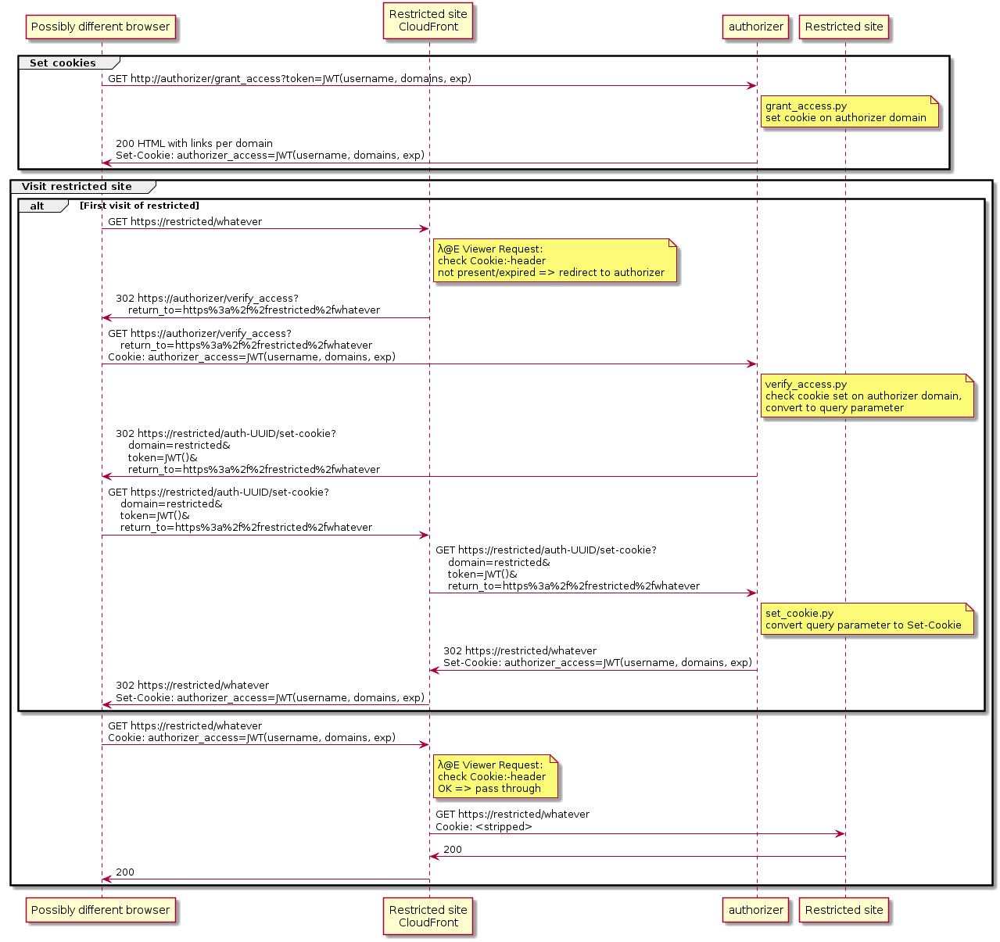
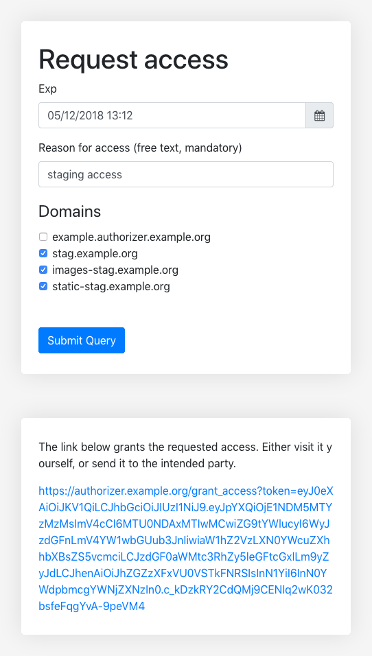
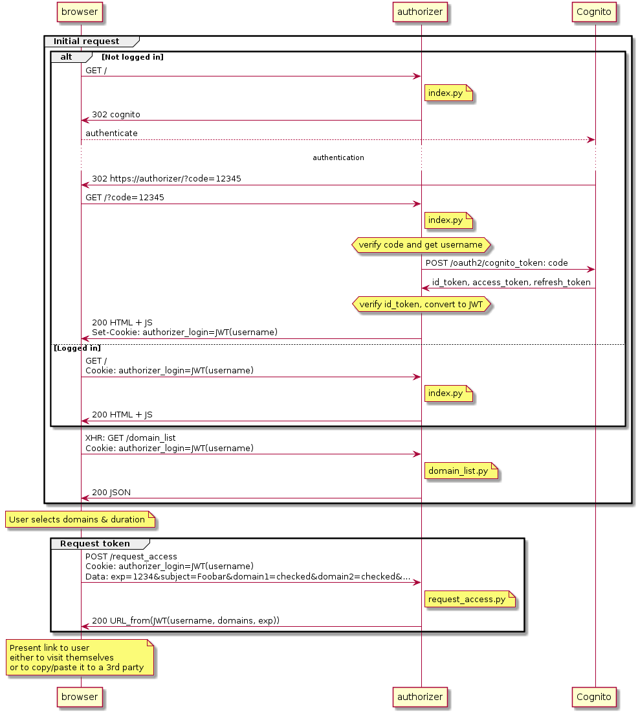
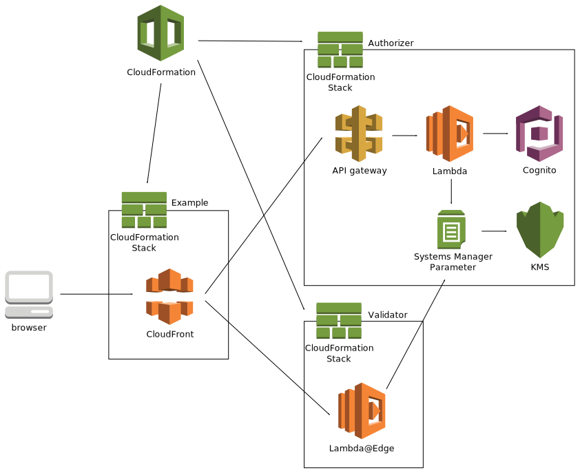

Limiting access to CloudFront
=============================

Introduction
------------

At VRT, we use [CloudFront] extensively to front most of our websites.
CloudFront is the [CDN] solution provided by [Amazon Web Services]. It provides
the usual benefits of a CDN, but it's also just cheaper per GB than serving
straight from EC2, at least for mostly European clients, like we have.

[CloudFront]: https://aws.amazon.com/cloudfront/
[CDN]: https://en.wikipedia.org/wiki/Content_delivery_network
[Amazon Web Services]: https://aws.amazon.com/

CloudFront allows some extensive configuration of its behaviour, such as
routing to different backends (origins), or setting up specific caching
behaviours. One of the newer features is [Lambda@Edge], which allows you to run
custom code on the CloudFront edge server for every request. Lambda@Edge
provides 4 hooks for your code to hook in to. Two hooks are run in the request
phase: when a request enters CloudFront and when CloudFront sends out a request
to the origin. The two remaining hooks are run for the corresponding responses.

[Lambda@Edge]: https://aws.amazon.com/lambda/edge/

Within your Lambda@Edge functions, you are free to inspect and/or modify the
request or response you are processing. You can even short-circuit the whole
process by generating a response right from the request-hook, bypassing the
whole backend.

Problem description
-------------------

Next to our public websites, most sites have a staging version that should not
be publicly accessible. This is challenging with CloudFront being a public
service. CloudFront does provide some mechanisms to restrict access, but none
of them fit our needs.

Our previous implementation uses Amazon's [Web Application Firewall] (WAF) to
limit access by source IP. This solution works, but filtering on Source IP has
its drawbacks. Especially with the rise of colleagues working at home (surfing
with their ISP's IP address), scanning proxies (which group lots of customers
behind a large block of addresses) and IPv6, it became clear that we wanted
to verify access on a "higher" layer.

[Web Application Firewall]: https://aws.amazon.com/waf/

Preferably, we would like the following properties for the authorisation
logic:

 * We want to verify if the *user* has access, independent of his current
   location or network setup.

 * Access should delegable. When a particular user has access, they should
   be able to share that access with other parties.

 * Access should always be limited in time and scope (i.e. which sites are
   allowed). This limits the impact of any stolen credentials.

 * Most of the components should be shared across several protected sites.

 * We want to grant access to non-human users as well: debug-builds of
   native apps, other backend systems that need staging access, ...

 * The observable behaviour of protected sites should be changed as little as
   possible.

Existing solutions
------------------

You can configure CloudFront to require that every request is [signed], with the
signature being either in the URL, or in a Cookie. This approach looks
promising, since it moves the authorisation from a network location (the IP you
appear to come from) to the user agent (browser) knowing a particular secret
(either as URL, or as a cookie), independent of the current network situation.

[signed]: https://docs.aws.amazon.com/AmazonCloudFront/latest/DeveloperGuide/PrivateContent.html

For our use case, we want to minimise the amount of changes to the sites that
are to be protected, so using signed URLs is not an option. Cookies are a good
candidate: they can be set once, and are automatically used by the browser,
even on cross-domain access from one protected site to another (e.g.
images.example.org from www.example.org).

The only thing left to do, is issuing a bunch of cookies to authorized browser
sessions, one set per domain that the user is authorized for. This turns out
to be quite a challenge... Let me reformulate the problem to see why: We want
to track a user across websites using 3rd party cookies. Does that sound like
online advertisement to you? Yeah, me too. And [browsers don't like it
either][SO-cookies]. The practical behaviour ranges from "users need to
explicitly accept the cookie for every domain" (Chrome) to "cookies are,
practically speaking, silently ignored" (Safari).

[SO-cookies]: https://meta.stackexchange.com/questions/64260/how-does-sos-new-auto-login-feature-work/64274#64274

Back to the drawing board...

The only way to set a cookie in a reliable way, is to do so when a user actually
accesses that particular domain. This implies that we need to intercept the case
when a user visits a protected domain without a cookie, or with an expired
cookie. CloudFront issues a 403-Forbidden in this situation, with fairly boring
XML content.

    HTTP/1.1 403 Forbidden
    Server: CloudFront
    Date: Mon, 20 Aug 2018 08:08:58 GMT
    Content-Type: text/xml
    Content-Length: 146
    Connection: keep-alive
    X-Cache: Error from cloudfront
    Via: 1.1 f188ead5b3846af391f02eedab2df3f7.cloudfront.net (CloudFront)
    X-Amz-Cf-Id: Qmxuwgo-QrasQfFyQRjsSoWDyTk3eifML6VAw0XHGdqk-hHPhk8dTw==

    <?xml version="1.0" encoding="UTF-8"?><Error><Code>MissingKey</Code><Message>Missing Key-Pair-Id query parameter or cookie value</Message></Error>

You can replace 403's with a [custom error page], and invoke some custom
logic to attempt to issue a cookie. However, this replacement is
distribution-wide, also replacing 403's that the backend issued. This would
change the observable behaviour of the protected site, which is unacceptable.

[custom error page]: https://docs.aws.amazon.com/AmazonCloudFront/latest/DeveloperGuide/GeneratingCustomErrorResponses.html

Lambda@Edge
-----------

So we replaced the built-in CloudFront logic to check the Cookie with our own
implementation. When a valid cookie is present, the HTTP request is passed
through, just as before. But when no cookie (or an expired cookie) is
present, the browser is redirected to the authorizer domain to check the
"master"-Cookie.

In order to do this Cookie-QueryParameter-Cookie dance, we need to hijack at
least one URL from the protected domain. This does change the observable
behaviour, but by choosing `/auth-89CE3FEF-FCF6-43B3-9DBA-7C410CAAE220`,
it's unlikely to actually impact the site.

Authorizing users
-----------------

To manage the "master"-Cookie on the authorizer domain, we implemented a very
basic workflow, implemented entirely with Lambda functions behind an
API-gateway. Authentication happens via [Cognito], which leverages our existing
[ADFS] infrastructure behind the scenes to authenticate users.

[ADFS]: https://en.wikipedia.org/wiki/Active_Directory_Federation_Services
[Cognito]: https://aws.amazon.com/cognito/

Once a user is authenticated, they can select which protected domains they want
access to, and specify an expiration time. The result is an URL with a signed
copy of the requested parameters. This URL represents the given access, and can
be passed on to third parties.

Visiting this URL sets the "master"-Cookie, which is checked for when accessing
a protected site.

Implementation details
----------------------

The solution is deployed via [CloudFormation], using the [Serverless framework].
It consists of four stacks:

 1. The authoriser API-gateway and the Lambda functions to implement it, the
    parameter to store the JWT-secret and the associated [KMS key and policy],
    the [Cognito User Pool] and [Client].

 2. The Lambda@Edge validator function. This is a separate template, since
    Lambda@Edge needs to be deployed in the `us-east-1` region, while we
    normally deploy in `eu-west-1`.

 3. A helper template to gather the required information from the two previous
    stacks in one place. (not depicted in the diagram)

 4. An example CloudFront distribution to document the needed settings. It
    imports the needed information from the helper-stack.

[CloudFormation]: https://aws.amazon.com/cloudformation/
[Serverless framework]: https://aws.amazon.com/serverless/
[KMS key and policy]: https://aws.amazon.com/kms/
[Cognito User Pool]: https://docs.aws.amazon.com/cognito/latest/developerguide/cognito-user-identity-pools.html
[Client]: https://docs.aws.amazon.com/cognito/latest/developerguide/user-pool-settings-client-apps.html

### Tokens

The used tokens are [JSON Web Tokens]. This implies that the data is "visible"
(albeit base64-encoded) to the client. For our use case, this is not a problem,
since it only contains non-secret information:

[JSON Web Tokens]: https://jwt.io/

 * The list of domains that you have access to

 * The expiration time of the access

 * The username of the person that generated the token
 
 * A free-text field describing the granted access

Since the party issuing tokens, and the party verifying tokens are the same, we
choose the faster and lighter `HS256` algorithm. The secret for the JWTs is
stored as a SecureString in the [Parameter Store].

[Parameter Store]: https://docs.aws.amazon.com/systems-manager/latest/userguide/systems-manager-paramstore.html

The authorisation cookie is stripped from the request by the Lambda@Edge
function. This is done for multiple reasons. Obviously, it's a security
enhancement: the Cookie contains "secret" information that is no longer needed
after this step. But it also reduces the observable changes in behaviour in
case the distribution is configured to use [this Cookie as part of its
Cache-key][CF-cache-cookie].

[CF-cache-cookie]: https://docs.aws.amazon.com/AmazonCloudFront/latest/DeveloperGuide/Cookies.html

### Configuration

Normally, you can configure a generic Lambda function via Environment Variables.
Lambda@Edge is tricky in this regard, since it does not support Environment
Variables. We worked around this issue by abusing the Tags.

The configuration itself is stored in an S3 bucket as JSON files. The name of
this S3 bucket is passed as a regular environment variable to the Python Lambda
functions, but as a Tag to the Lambda@Edge function. The Lambda@Edge function
performs a `lambda:GetFunction` on itself (it can find out its own name from the
`context` object at runtime) to read its own Tags.

Code
----

The code for our solution can be found on [our GitHub account]. The repository
consists of three main parts:

[our GitHub account]: https://github.com/vrtdev/aws-cloudfront-authorizer

* The source code of the Python Lambda functions, located in the `src`
  directory. The corresponding build-script (`build-python.sh`) bundles these
  files into a ZIP file, ready to deploy to AWS Lambda. The build-script
  optionally outputs a hash of the ZIPed content. We use this hash in the S3
  key, which allows CloudFormation to be smart when updating the resources.
  Additionally, tests are located in the `test` directory, and can be run with
  the standard `pytest` command (make sure to add `src` to your $PYTHONPATH,
  if your IDE doesn't do this for you).

* The source code of the Lambda@Edge function, located in the `λ@E` directory.
  The corresponding build-script (`build-nodejs.sh`) is similar to the Python
  variant described above.

* The CloudFormation templates, located in the `templates` directory. The
  corresponding build-script (`build-cfn.sh`) converts these to JSONs in the
  `output` directory.

Conclusion
----------

The authoriser accomplishes most of what we wanted to achieve. It prevents
unauthorised access, while providing a self-service way for authorised users to
delegate their permissions to third parties (suppliers, native apps, …).
CloudFront distributions that want to use the authoriser only require minimal
changes to make use of the provided service. Unfortunately, the observable
behaviour of protected websites is slightly changed: a particular (but
configurable) path-prefix is no longer available for the site to use.
